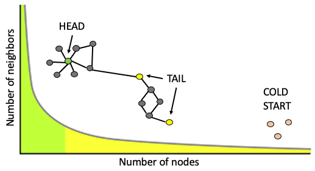
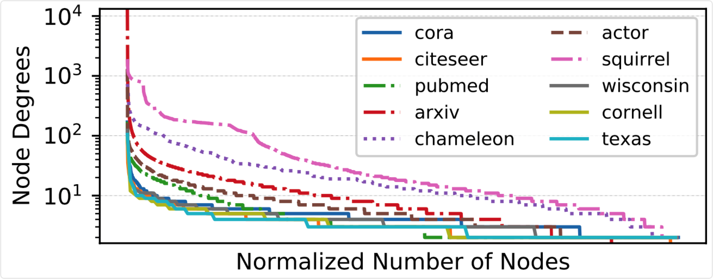
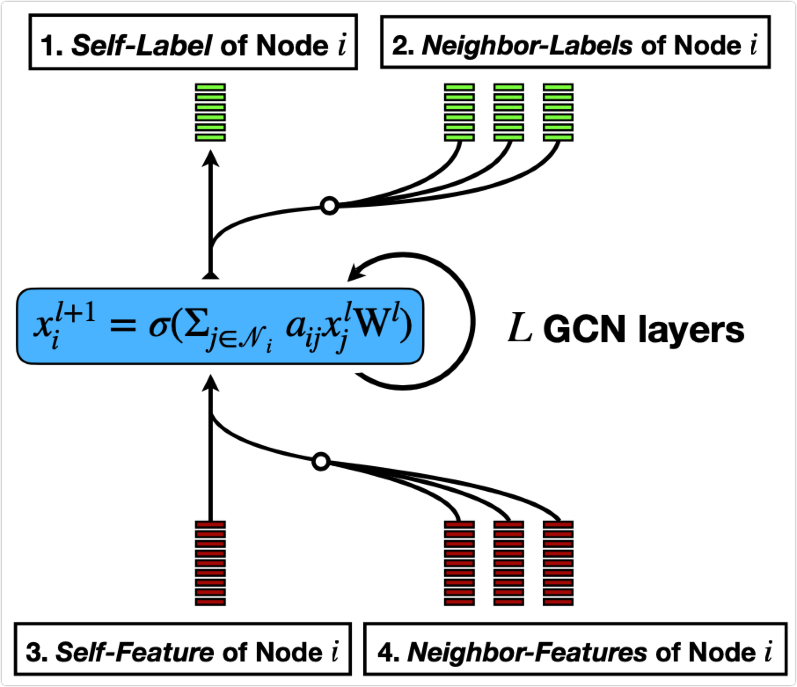
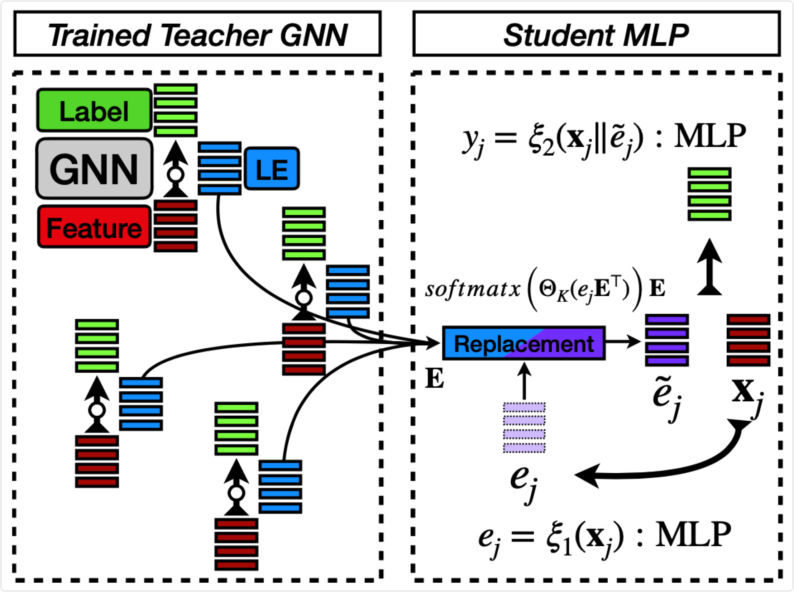

# Cold Brew: Distilling Graph Node Representations with Incomplete or Missing Neighborhoods
## Introduction

Graph Neural Networks (GNNs) have demonstrated superior performance in node classification or regression tasks, and have emerged as the state of the art in several applications. However, (inductive) GNNs require the edge connectivity structure of nodes to be known beforehand to work well. This is often not the case in several practical applications where the node degrees have power-law distributions, and nodes with a few connections might have noisy edges. An extreme case is the strict cold start (SCS) problem, where there is no neighborhood information available, forcing prediction models to rely completely on node features only. To study the viability of using inductive GNNs to solve the SCS problem, we introduce feature-contribution ratio (FCR), a metric to quantify the contribution of a node's features and that of its neighborhood in predicting node labels, and use this new metric as a model selection reward. We then propose Cold Brew, a new method that generalizes GNNs better in the SCS setting compared to pointwise and graph-based models, via a distillation approach. We show experimentally how FCR allows us to disentangle the contributions of various components of graph datasets, and demonstrate the superior performance of Cold Brew on several public benchmarks

## Motivation

Long tail distribution is ubiquitously existed in large scale graph mining tasks. In some applications, some cold start nodes have too few or no neighborhood in the graph, which make graph based methods sub-optimal due to insufficient high quality edges to perform message passing.





## Method

We improve teacher GNN with Structural Embedding, and propose student MLP model with latent neighborhood discovery step. We also propose a metric called FCR to judge the difficulty in cold start generalization.






## Installation Guide

The following commands are used for installing key dependencies; other can be directly installed via pip or conda. A full redundant dependency list is in `requirements.txt`

```
pip install dgl
pip3 install torch==1.9.0+cu111 torchvision==0.10.0+cu111 torchaudio==0.9.0 -f https://download.pytorch.org/whl/torch_stable.html
pip install torch-scatter -f https://pytorch-geometric.com/whl/torch-1.9.0+cu111.html
pip install torch-sparse -f https://pytorch-geometric.com/whl/torch-1.9.0+cu111.html
pip install torch-geometric
```

## Training Guide

In `options/base_options.py`, a full list of useable args is present, with default arguments and candidates initialized.

### Comparing between traditional GCN (optimized with Initial/Jumping/Dense/PairNorm/NodeNorm/GroupNorm/Dropouts) and Cold Brew's GNN (optimized with Structural Embedding)

#### Train optimized traditional GNN:

`python main.py --dataset='Cora' --train_which='TeacherGNN' --whetherHasSE='000' --want_headtail=1 --num_layers=2 --use_special_split=1` Result: `84.15`

`python main.py --dataset='Citeseer'  --train_which='TeacherGNN' --whetherHasSE='000'  --want_headtail=1 --num_layers=2 --use_special_split=1` Result: `71.00`

`python main.py --dataset='Pubmed'  --train_which='TeacherGNN' --whetherHasSE='000'  --want_headtail=1 --num_layers=2 --use_special_split=1` Result: `78.2`

#### Training Cold Brew's Teacher GNN:

`python main.py --dataset='Cora'  --train_which='TeacherGNN' --whetherHasSE='100' --se_reg=32 --want_headtail=1 --num_layers=2 --use_special_split=1` Result: `85.10`

`python main.py --dataset='Citeseer'  --train_which='TeacherGNN' --whetherHasSE='100' --se_reg=0.5 --want_headtail=1 --num_layers=2 --use_special_split=1 ` Result:  `71.40`

`python main.py --dataset='Pubmed'  --train_which='TeacherGNN' --whetherHasSE='111' --se_reg=0.5 --want_headtail=1 --num_layers=2 --use_special_split=1` Result: `78.2`

### Comparing between MLP models:

#### Training naive MLP: 

`python main.py --dataset='Cora' --train_which='StudentBaseMLP'` Result on isolation split: `63.92`

#### Training GraphMLP: 

`python main.py --dataset='Cora' --train_which='GraphMLP'` Result on isolation split: `68.63`

#### Training Cold Brew's MLP:

`python main.py --dataset='Cora'  --train_which="SEMLP" --SEMLP_topK_2_replace=3 --SEMLP_part1_arch="2layer" --dropout_MLP=0.5  --studentMLP__opt_lr='torch.optim.Adam&0.005'` Result on isolation split: `69.57`

## Hyperparameter meanings

`--whetherHasSE`:  whether cold brew's TeacherGNN has structural embedding.  The first ‘1’ means structural embedding exist in first layer; second ‘1’ means structural embedding exist in every middle layers; third ‘1’ means last layer.

`--se_reg`: regularization coefficient for cold brew teacher model's structural embedding.

`--SEMLP_topK_2_replace`:  the number of top K best virtual neighbor nodes.

`--manual_assign_GPU`: set the GPU ID to train on. default=-9999, which means to dynamically choose GPU with most remaining memory.


## Adaptation Guide

#### How to leverage this repo to train on other datasets:

In `trainer.py`, put any new graph dataset (node classification) under `load_data()` and return it.

what to load:
    return a dataset, which is a namespace, called 'data', 
    data.x: 2D tensor, on cpu; shape = [N_nodes, dim_feature].
    data.y: 1D tensor, on cpu; shape = [N_nodes]; values are integers, indicating the class of nodes.
    data.edge_index: tensor: [2, N_edge], cpu; edges contain self loop.
    data.train_mask: bool tensor, shape = [N_nodes], indicating the training node set.
    Template class for the 'data':

```
class MyDataset(torch_geometric.data.data.Data):
    def __init__(self):
        super().__init__()
```

# Citation

```
@article{zheng2021cold,
  title={Cold Brew: Distilling Graph Node Representations with Incomplete or Missing Neighborhoods},
  author={Zheng, Wenqing and Huang, Edward W and Rao, Nikhil and Katariya, Sumeet and Wang, Zhangyang and Subbian, Karthik},
  journal={arXiv preprint arXiv:2111.04840},
  year={2021}
}
```

